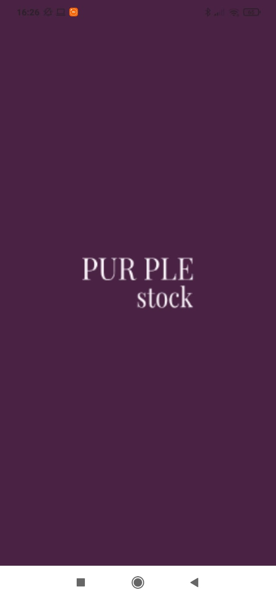
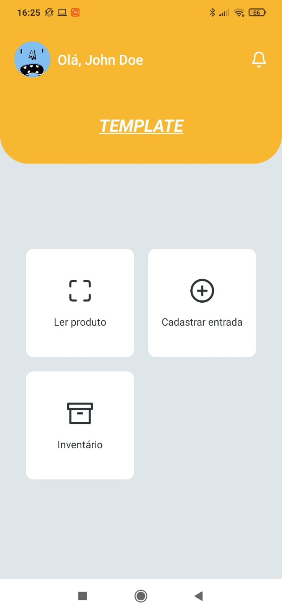
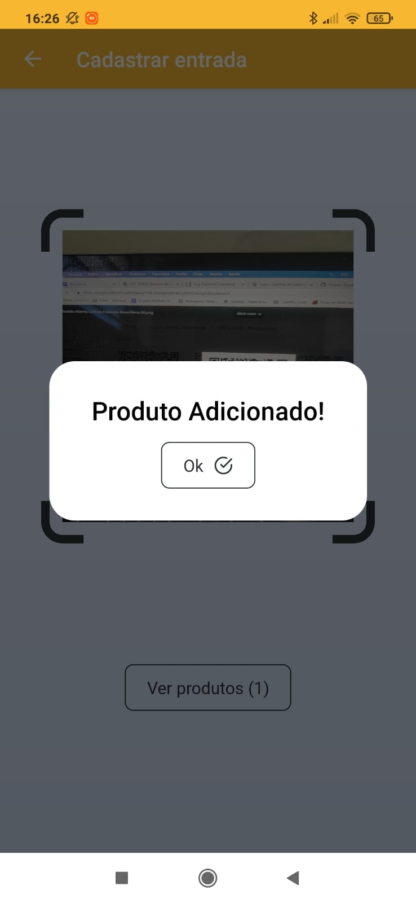
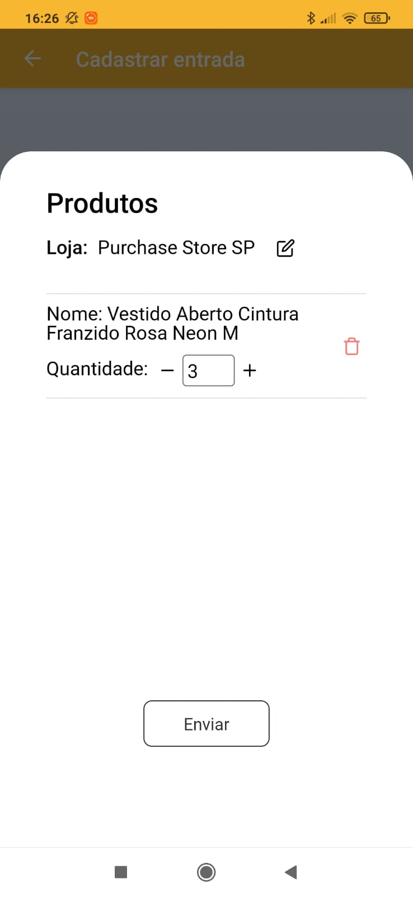

# Purple Stock

Mobile app built-in React Native with Expo to serve as a stock control system.

## Images from Application





## Installation

```bash
$ expo install
```

## Running the app

```bash
# Android
$ yarn android

# iOS
$ yarn ios
```

## Environment

- Node.js v12.18.4 LTS
- React Native v4.13.0
- Expo v3.27.13
- Android/iOS Simulator

## License

This project is licensed under the MIT License - see the [LICENSE](LICENSE) file for details
